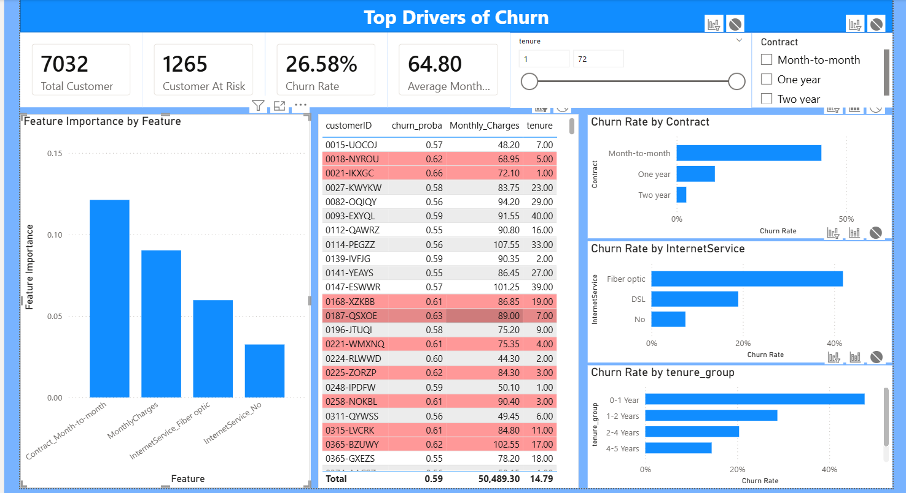
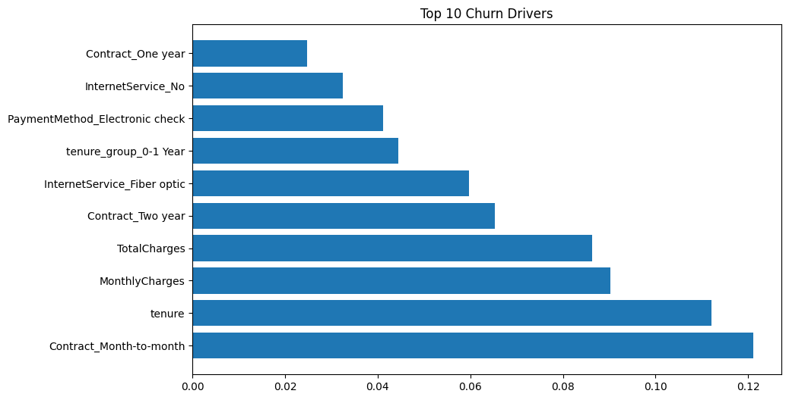

# 📊 Customer Churn Analysis & Prediction

## 📌 Project Title

**Customer Churn Analysis**

---

## ❓ Problem Statement

Customer churn occurs when a customer stops using a company's product or service over time.

The goal of this project is to predict customer churn and identify high-risk customers in advance. This enables businesses to take proactive steps to improve customer retention and reduce revenue loss.

This project focuses on:

* Analyzing customer behavior
* Identifying churn patterns
* Building a predictive machine learning model
* Visualizing insights through an interactive dashboard

---

## 🛠️ Tools & Technologies Used

* **Programming Language:** Python
* **Libraries:** Pandas, NumPy, Matplotlib, Seaborn, Scikit-learn
* **Visualization Tool:** Power BI
* **Machine Learning:** Classification (Random Forest)

---

## 🔄 Project Workflow

### 1️⃣ Data Cleaning

* Handled missing values and inconsistencies
* Removed duplicate records
* Standardized data formats and data types
* Prepared categorical data for analysis

---

### 2️⃣ Feature Engineering

* Created new features (e.g., tenure groups)
* Encoded categorical variables
* Prepared data for machine learning models

---

### 3️⃣ Model Building

* Used stratified sampling to maintain churn distribution
* Trained a **Random Forest Classifier**
* Applied a custom threshold (**0.3**) to improve recall for churn detection
* Evaluated model performance using:

  * Confusion Matrix
  * Precision, Recall, F1-score

---

### 4️⃣ Power BI Dashboard

An interactive dashboard was created to provide business insights and support decision-making.

#### 🔹 Key Metrics (KPIs)

* **Total Customers:** 7032
* **Customers At Risk:** 1265
* **Churn Rate:** 26.58%
* **Average Monthly Charges:** 64.80

#### 🔹 Analysis Visuals

* **Feature Importance:** Identifies key drivers of churn
* **Churn by Contract:** Month-to-month customers show highest churn
* **Churn by Internet Service:** Fiber Optic users are more likely to churn
* **Churn by Tenure:** New customers have higher churn probability

#### 🔹 Customer Risk Table

* Displays individual churn probability
* Highlights high-risk customers (**probability > 0.60**)
* Includes key attributes like Monthly Charges and Tenure

#### 🔹 Filters

* Tenure range (1–72 months)
* Contract type selection

---

## 📸 Dashboard Preview

### Dashboard Overview



### Churn Analysis



---

## ▶️ How to Run the Project

### 🔹 1. Clone the Repository

```bash
git clone https://github.com/your-username/customer-churn-analysis.git
cd customer-churn-analysis
```

### 🔹 2. Install Dependencies

```bash
pip install -r requirements.txt
```

### 🔹 3. Run the Model

```bash
python scripts/03_model_prediction.py
```

OR open notebooks:

```bash
jupyter notebook
```

### 🔹 4. Open Dashboard

* Open the `.pbix` file in Power BI Desktop
* Refresh data if required

---

## 📈 Key Insights

* Month-to-month contracts have the highest churn rate
* Customers with low tenure are more likely to leave
* Fiber Optic users show higher churn behavior
* Higher monthly charges increase churn risk
* The model effectively identifies high-risk customers

---

## 🚀 Future Improvements

* Implement advanced models (XGBoost, LightGBM)
* Perform hyperparameter tuning
* Build a real-time dashboard pipeline
* Deploy a web app using Streamlit or Flask
* Use larger and more diverse datasets

---

## 👤 Author

**Soumalya Hazra**

* GitHub: https://github.com/Soumalya900
* LinkedIn: https://www.linkedin.com/in/soumalya-hazra

---

⭐ If you found this project useful, consider giving it a star!
